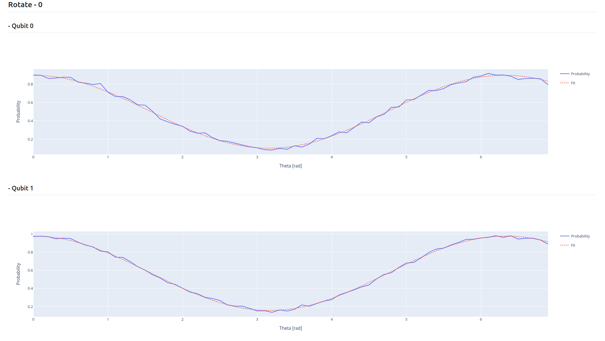

Advanced examples
=================

How to use Qibocal as a library
-------------------------------

Qibocal also allows executing protocols without the standard :ref:`interface <interface>`.

In the following tutorial we show how to run a single protocol using Qibocal as a library.
For this particular example we will focus on the `single shot classification protocol
<https://github.com/qiboteam/qibocal/blob/main/src/qibocal/protocols/characterization/classification.py>`_.

.. code-block:: python

    from qibocal.protocols.characterization import Operation
    from qibolab import create_platform

    # allocate platform
    platform = create_platform("....")
    # get qubits from platform
    qubits = platform.qubits

    # we select the protocol
    protocol = Operation.single_shot_classification.value

``protocol`` is a `Routine <https://qibo.science/qibocal/stable/api-reference/qibocal.auto.html#qibocal.auto.operation.Routine>`_ object which contains all the necessary
methods to execute the experiment.

In order to run a protocol the user needs to specify the parameters.
The user can check which parameters need to be provided either by checking the
documentation of the specific protocol or by simply inspecting ``protocol.parameters_type``.
For ``single_shot_classification`` we can pass just the number of shots
in the following way:

.. code-block:: python

    parameters = experiment.parameters_type.load(dict(nshots=1024))

After defining the parameters, the user can perform the acquisition using
``experiment.acquisition`` which accepts the following parameters:

* params (`experiment.parameters_type <https://qibo.science/qibocal/latest/api-reference/qibocal.auto.html#qibocal.auto.operation.Routine.parameters_type>`_): input parameters for the experiment
* platform (`qibolab.platform.Platform <https://qibo.science/qibolab/latest/api-reference/qibolab.html#qibolab.platform.Platform>`_): Qibolab platform class
* qubits (dict[`QubitId <https://qibo.science/qibolab/latest/api-reference/qibolab.html#qibolab.qubits.QubitId>`_, `QubitPairId <https://qibo.science/qibolab/latest/api-reference/qibolab.html#qibolab.qubits.QubitPairId>`_]) dictionary with qubits where the acquisition will run

and returns the following:

* data (`experiment.data_type <https://qibo.science/qibocal/latest/api-reference/qibocal.auto.html#qibocal.auto.operation.Routine.data_type>`_): data acquired
* acquisition_time (float): acquisition time on hardware

.. code-block:: python

    data, acquisition_time = experiment.acquisition(params=parameters, platform=platform, qubits=qubits)

The user can now use the raw data acquired by the quantum processor to perform
an arbitrary post-processing analysis. This is one of the main advantages of this API
compared to the cli execution.

The fitting corresponding to the experiment (``experiment.fit``) can be launched in the
following way:

.. code-block:: python

    fit, fit_time = experiment.fit(data)

To be more specific the user should pass as input ``data`` which is of type
``experiment.data_type`` and the outputs are the following:

* fit: (`experiment.results_type <https://qibo.science/qibocal/latest/api-reference/qibocal.auto.html#qibocal.auto.operation.Routine.results_type>`_) input parameters for the experiment
* fit_time (float): post-processing time

It is also possible to access the plots and the tables generated in the
report using ``experiment.report`` which accepts the following parameters:

* data: (`experiment.data_type <https://qibo.science/qibocal/latest/api-reference/qibocal.auto.html#qibocal.auto.operation.Routine.data_type>`_) data structure used by ``experiment``
* qubit (dict[`QubitId <https://qibo.science/qibolab/latest/api-reference/qibolab.html#qibolab.qubits.QubitId>`_, `QubitPairId <https://qibo.science/qibolab/latest/api-reference/qibolab.html#qibolab.qubits.QubitPairId>`_]): qubit / qubit pair to be plotted
* fit: (`experiment.results_type <https://qibo.science/qibocal/latest/api-reference/qibocal.auto.html#qibocal.auto.operation.Routine.results_type>`_): data structure for post-processing used by ``experiment``

.. code-block:: python

    # Plot for qubit 0
    qubit = 0
    figs, html_content = experiment.report(data=data, qubit=0, fit=fit)

``experiment.report`` returns the following:

* figs: list of plotly figures
* html_content: raw html with additional information usually in the form of a table

In our case we get the following figure for qubit 0:

.. code-block:: python

    figs[0]

.. image:: classification_plot.png

and we can render the html content in the following way:

.. code-block:: python

    import IPython
    IPython.display.HTML(html_content)

.. image:: classification_table.png

How to add a new protocol
-------------------------

In this tutorial we show how to add a new protocol to ``Qibocal``.

Protocol implementation in ``Qibocal``
~~~~~~~~~~~~~~~~~~~~~~~~~~~~~~~~~~~~~~

Currently, characterization/calibration protocols are divided in three steps: `acquisition`, `fit` and `plot`. ``Qibocal`` provides three data structures  *input parameters*, *data acquired* and
*results*, that collect all the information concerning the routine.

The relationship between steps and data structures are summarized in the following bullets:

* `acquisition` receives as input `parameters` and outputs `data`
* `fit` receives as input `data` and outputs `results`
* `plot` receives as input `data` and `results` to visualize the protocol

This approach is flexible enough to allow the data acquisition without performing a post-processing analysis.

Step by step tutorial
~~~~~~~~~~~~~~~~~~~~~

All protocols are located in `src/qibocal/protocols/characterization <https://github.com/qiboteam/qibocal/tree/main/src/qibocal/protocols/characterization>`_.
Suppose that we want to code a protocol to perform a RX rotation for different
angles.

We create a file ``rotate.py`` in ``src/qibocal/protocols/characterization``.

Parameters
^^^^^^^^^^
First, we define the input parameters.

.. code-block:: python

    from dataclasses import dataclass
    from ...auto.operation import Parameters

    @dataclass
    class RotationParameters(Parameters):
        """Parameters for rotation protocol."""

        theta_start: float
        """Initial angle."""
        theta_end: float
        """Final angle."""
        theta_step: float
        """Angle step."""
        nshots: int
        """Number of shots."""

In this case you define a range for the angle to be probed alongside the number
of shots.

.. note::
      It is advised to use `dataclasses`. If you are not familiar
      have a look at the official `documentation <https://docs.python.org/3/library/dataclasses.html>`_.

Data structure
^^^^^^^^^^^^^^
Secondly, we define a data structure that aims at storing both the angles and
the probabilities measured for each qubit. A generic data structure is usually composed
of some raw data (the data attribute), which is usually coded as a dictionary of arrays
plus additional information if required.

.. code-block:: python

    import numpy as np
    import numpy.typing as npt
    from dataclasses import dataclass, field
    from ...auto.operation import Data

    RotationType = np.dtype([("theta", np.float64), ("prob", np.float64)])

    @dataclass
    class RotationData(Data):
        """Rotation data."""

        data: dict[QubitId, npt.NDArray[RotationType]] = field(default_factory=dict)
        """Raw data acquired."""

        def register_qubit(self, qubit, theta, prob):
            """Store output for single qubit."""
            ar = np.empty((1,), dtype=RotationType)
            ar["theta"] = theta
            ar["prob"] = prob
            if qubit in self.data:
                self.data[qubit] = np.rec.array(np.concatenate((self.data[qubit], ar)))
            else:
                self.data[qubit] = np.rec.array(ar)

.. note::
      When the protocols will be executed the data will be saved automatically.
      The `data` attribute will be stored as a `npz` file, while the rest of the
      information will be stored as `json` file. If the user would like
      to use a custom format the implementation of a `save` method inside the
      data structure will be necessary.

Acquisition function
^^^^^^^^^^^^^^^^^^^^
In the acquisition function we are going to perform the experiment.

.. note::
      A generic acquisition function must have the following signature

      .. code-block:: python

        from qibolab.platform import Platform
        from ...auto.operation import Qubits

        def acquisition(params: RoutineParameters, platform: Platform, qubits: Qubits) -> RoutineData
        """ A generic acquisition function."""

    where `Qubits` is a `dict[QubitId, Qubit]`.

.. code-block:: python

    from qibolab.platform import Platform
    from ...auto.operation import Qubits

    def acquisition(
        params: RotationParameters,
        platform: Platform,
        qubits: Qubits,
    ) -> RotationData:
        r"""
        Data acquisition for rotation routine.

        Args:
            params (:class:`RotationParameters`): input parameters
            platform (:class:`Platform`): Qibolab's platform
            qubits (dict): dict of target :class:`Qubit` objects to be characterized

        Returns:
            data (:class:`RotationData`)
        """

        # costruct range from RotationParameters
        angles = np.arange(params.theta_start, params.theta_end, params.theta_step)
        # create data structure
        data = RotationData()

        # create and execute circuit for each angle
        for angle in angles:

            circuit = Circuit(platform.nqubits)
            for qubit in qubits:
                circuit.add(gates.RX(qubit, theta=angle))
                circuit.add(gates.M(qubit))

            result = circuit(nshots=params.nshots)

            for qubit in qubits:

                # extract probability of 0
                prob = result.probabilities(qubits=[qubit])[0]
                # store measurements in Rotation Data
                data.register_qubit(qubit, theta=angle, prob=prob)

        return data

Result class
^^^^^^^^^^^^

Here we decided to code a generic `Result` that contains the fitted
parameters for each quibt.

.. code-block:: python

    from qibolab.qubits import QubitId

    @dataclass
    class RotationResults(Results):
        """Results object for data"""
        fitted_parameters: dict[QubitId, list] = field(default_factory=dict)

Fit function
^^^^^^^^^^^^

The following function performs a sinusoidal fit for each qubit.

.. note::
      A generic fit function must have the following signature

      .. code-block:: python

        def fit(data: RoutineData) -> RoutineResults
        """ A generic fit."

    where `Qubits` is a `dict[QubitId, Qubit]`.

.. code-block:: python

    from scipy.optmize import curve_fit

    def fit(data: RotationData) -> RotationResults:

        qubits = data.qubits
        freqs = {}
        fitted_parameters = {}

        def cos_fit(x, offset, amplitude, omega):
            return offset + amplitude * np.cos(omega*x)

        for qubit in qubits:
            qubit_data = data[qubit]
            thetas = qubit_data.theta
            probs = qubit_data.prob

            popt, _ = curve_fit(cos_fit, thetas, probs)

            freqs[qubit] = popt[2] / 2*np.pi
            fitted_parameters[qubit]=popt.tolist()

        return RotationResults(
            fitted_parameters=fitted_parameters,
        )

Report function
^^^^^^^^^^^^^^^

The report function generates a list of figures and an optional table
to be shown in the html report. For the plotting function the user must
use `plotly <https://plotly.com/python/>`_ in order to properly generate the report.

.. note::
    A generic report function must have the following signature

    .. code-block:: python

        import plotly.graph_objects as go

        def plot(data: RoutineData, fit: RoutineResults, qubit: QubitId) -> list[go.Figure(), str]
        """ A generic plotting function."""

    The `str` in output can be used to create a table, which has 3 columns `qubit`, `Fitting Parameter`
    and `Value`. Here is the syntax necessary to insert a raw in the table.

    .. code-block:: python

        report = ""
        qubit = 0
        angle = 3.14
        report += f" {qubit} | rotation angle: {angle:.3f} "

    This table can be omitted by returnig ``None``.

Here is the plotting function for the protocol that we are coding:

.. code-block:: python

    import plotly.graph_objects as go

    def plot(data: RotationData, fit: RotationResults, qubit):
    """Plotting function for rotation."""

        figures = []
        fig = go.Figure()

        fitting_report = ""
        qubit_data = data[qubit]

        fig.add_trace(
            go.Scatter(
                x=qubit_data.theta,
                y=qubit_data.prob,
                opacity=1,
                name="Probability",
                showlegend=True,
                legendgroup="Voltage",
            ),
        )

        if fit is not None:
            fig.add_trace(
                go.Scatter(
                    x=qubit_data.theta,
                    y=cos_fit(
                        qubit_data.theta,
                        *fit.fitted_parameters[qubit],
                    ),
                    name="Fit",
                    line=go.scatter.Line(dash="dot"),
                ),
            )

        # last part
        fig.update_layout(
            showlegend=True,
            uirevision="0",  # ``uirevision`` allows zooming while live plotting
            xaxis_title="Theta [rad]",
            yaxis_title="Probability",
        )

        figures.append(fig)

        return figures, fitting_report

Create ``Routine`` object
^^^^^^^^^^^^^^^^^^^^^^^^^

.. code-block:: python

    rotation = Routine(acquisition, fit, plot)
    """Rotation Routine  object."""

Add routine to `Operation` Enum
^^^^^^^^^^^^^^^^^^^^^^^^^^^^^^^

The last step is to add the routine that we just created
to the ``Operation`` `Enum` in `src/qibocal/protocols/characterization/__init__.py <https://github.com/qiboteam/qibocal/tree/main/src/qibocal/protocols/characterization/__init__.py>`_:

.. code-block:: python

    # other imports...
    from rotate import rotation

    class Operation(Enum):
    ### other protocols...
    rotation = rotation

Write a runcard
^^^^^^^^^^^^^^^

To launch the protocol a possible runcard could be the following one:

.. code-block:: yaml

    platform: dummy

    qubits: [0,1]

    actions:
        - id: rotate
          priority: 0
          operation: rotation
          parameters:
            theta_start: 0
            theta_end: 7
            theta_step: 20
            nshots: 1024

For more information about how to execute runcards see :ref:`runcard`.

Here is the expected output:

