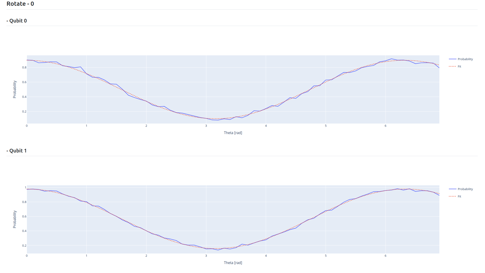

Advanced examples
=================

How to use Qibocal as a library
-------------------------------

Qibocal also allows executing protocols without the standard :ref:`interface <interface>`.

The :class:`~qibocal.Executor` directly executes a protocol with explicitly bound
acquisition, fit and report parameters:

.. code-block:: python

    from qibocal import Executor, Protocol, create_calibration_platform

    protocol = Protocol(
        acquisition=lambda samples: samples,
        fit=lambda data, fitpars: sum(data) / len(data),
    )
    bound = protocol(pars=[1.0, 2.0, 3.0])
    executor = Executor(create_calibration_platform("mock"))
    completed = executor(bound, targets=[])
    print(completed.results)  # 2.0

Only acquisition is required. Optional fit, report and update functions are run
when provided; ``executor(bound, skip_fit=True)`` performs acquisition alone.
Updates use the protocol's update function, passing the results and executor's
platform. ``Executor(platform, update=False)`` disables automatic updates.
Individual phases can also be invoked through ``acquire(bound)``,
``fit(completed)``, ``report(completed)`` and ``update(completed)``.
Every phase returns a new :class:`~qibocal.auto.task.Completed` instance,
preserving the input execution. Acquisition stores its bound protocol in
``completed.bound``; downstream phases reuse that binding and attach their
outputs to the returned instance. Fitting attaches ``results`` and reporting
attaches ``reports``. Re-fitting clears previous reports.

``executor(...)`` and ``acquire(...)`` require an explicitly bound protocol.
Bind acquisition, fit and report parameters through ``protocol(pars=..., fit=...,
report=...)`` before executing it. Acquisition parameters can also be supplied
directly as keywords to the protocol's binding interface.

Built-in protocols can be bound directly from keywords, including ``nshots`` and
``relaxation_time``, or from an existing parameter object using ``pars=...``.
Required sweep fields must be provided; optional protocol fields retain their
defaults. Unspecified execution parameters use the selected platform's settings
at acquisition time, without modifying the bound parameters.
``acquire`` and ``executor(...)`` also accept these settings directly as keyword
arguments. They take priority over bound parameters without modifying them.
The completed execution retains the effective binding, including platform
defaults and execution overrides.

The executor supplies ``platform`` and ``targets`` to callbacks that declare
those arguments. Every phase and ``executor(bound)`` accept ``targets=...`` in
their keyword arguments, overriding executor defaults without changing them.
Each executor is bound to one platform; method calls cannot override it.
Protocol parameters named ``platform`` must be supplied when binding the
protocol, not to executor methods.
Default targets are optional in ``Executor(...)``, ``Executor.create(...)`` and
``Executor.open(...)``. When omitted, acquisition must supply ``targets=...``.
An explicit empty list is valid for protocols that do not use targets.
Downstream phases infer targets from ``completed.data`` (qubits or pairs as
appropriate), rather than the executor's defaults. For custom data without
target metadata, the acquisition selection is retained in ``Completed``.

Fit parameters are passed only to callbacks declaring ``fitpars`` (or
``fit_params``); built-in ``fit(data)`` callbacks receive only data. Similarly,
report parameters are passed only when ``reportpars`` (or ``report_params``)
is declared. Report results are passed as ``fit=results`` for built-in reports,
or ``results=results`` for custom callbacks. Callbacks declaring a singular
``target`` report once per selected target; ``completed.reports`` contains
a mapping from each target to its callback output (typically figures and an
HTML table). Other report callbacks store their output directly in that field.
Update callbacks declaring ``target`` or ``qubit`` run once per selected target;
callbacks declaring ``targets`` receive the full selection. Callback exceptions
propagate, including failures for targets without fit results.

Direct execution neither connects/disconnects the platform nor writes files.
The caller owns the connection lifecycle, including exception-safe cleanup:

.. code-block:: python

    from qibocal import Executor, create_calibration_platform
    from qibocal.protocols import rabi_amplitude

    platform = create_calibration_platform("my_platform")
    executor = Executor(platform, targets=[0, 1], update=False)
    bound = rabi_amplitude(
        min_amp=0, max_amp=1, step_amp=0.02,
        nshots=4096, relaxation_time=0,
    )
    try:
        platform.connect()
        acquired = executor.acquire(bound)
    finally:
        platform.disconnect()

    fitted = executor.fit(acquired)
    reported = executor.report(fitted)
    figures, table = reported.reports[0]
    executor.update(fitted, targets=[0])  # explicit opt-in session update

The same executor supports output directories and platform connection management
through ``Executor.create`` and ``Executor.open``. ``create`` constructs the
executor. Entering its context creates the output directory, saves the initial
platform snapshot and starts the timer only once, while connecting the platform
on every entry. ``close`` disconnects it and saves metadata, the supplied history
and the updated platform. ``open`` wraps initialization and finalization in a
context manager and accepts ``force=True`` to overwrite an existing output
directory on first initialization.
Direct calls do not populate ``executor.history`` or persist acquired data and
fit results. Runcards manage calibration task orchestration and persistence
separately.

In the following tutorial we show how to run a single protocol using Qibocal as a library.
For this particular example we will focus on the `t1_signal protocol
<https://github.com/qiboteam/qibocal/blob/main/src/qibocal/protocols/coherence/t1_signal.py>`_ (see also :ref:`t1`).
The fastest way consists in using the `Executor` class in the following way

.. code-block:: python

    from qibocal.auto.execute import Executor
    from qibocal.protocols import t1_signal

    with Executor.open(
        path="test_t1_signal", # path for metadata and platform snapshots
        platform="my_platform", # platform to be used
        targets=[0], # qubits on which the experiment will be executed
    ) as e:

        # your experiments go here

The executor runs protocols on a platform. The context manager ``with`` provides
an easy way to connect and disconnect from the platform, including on exceptions.
It does not save data or results from direct protocol calls.

In order to run an experiment the user needs to specify its parameters.
The user can check which parameters need to be provided either by checking the
documentation of the specific protocol or by simply inspecting ``protocol.parameters_type``.
To run a ``t1_signal`` experiment, pass the imported protocol to the executor
inside the ``with`` statement:

.. code-block:: python

    output = e(
        t1_signal(
            delay_before_readout_start=0,
            delay_before_readout_end=20_000,
            delay_before_readout_step=50,
        )
    )

By default acquisition and fitting are performed.

The user can now use the raw data acquired by the quantum processor to perform
an arbitrary post-processing analysis. This is one of the main advantages of this API
compared to the cli execution.

Both the raw data and the fit results are available on the returned
:class:`qibocal.auto.task.Completed` object:

.. code-block:: python

    data = output.data  # raw data
    results = output.results  # fit results
    figures, table = output.reports[0]  # report for target 0

Use ``e(t1_signal(...), skip_fit=True)`` to acquire without fitting. Save data,
results or figures explicitly if they are needed after the session.

How to add a new protocol
-------------------------

In this tutorial we show how to add a new protocol to ``Qibocal``.

Protocol implementation in ``Qibocal``
~~~~~~~~~~~~~~~~~~~~~~~~~~~~~~~~~~~~~~

Currently, characterization/calibration protocols are divided in three steps: `acquisition`, `fit` and `plot`. ``Qibocal`` provides three data structures  *input parameters*, *data acquired* and
*results*, that collect all the information concerning the routine.

The relationship between steps and data structures are summarized in the following bullets:

* ``acquisition`` receives as input ``parameters`` and outputs ``data``
* ``fit`` receives as input ``data`` and outputs ``results``
* ``plot`` receives as input ``data`` and ``results`` to visualize the protocol

This approach is flexible enough to allow the data acquisition without performing a post-processing analysis.

Step by step tutorial
~~~~~~~~~~~~~~~~~~~~~

All protocols are located in :mod:`qibocal.protocols`.
Suppose that we want to code a protocol to perform a RX rotation for different
angles.

We create a file ``rotate.py`` in ``src/qibocal/protocols``.

Parameters
^^^^^^^^^^
First, we define the input parameters.

.. code-block:: python

    from dataclasses import dataclass
    from ...auto.operation import Parameters

    @dataclass
    class RotationParameters(Parameters):
        """Parameters for rotation protocol."""

        theta_start: float
        """Initial angle."""
        theta_end: float
        """Final angle."""
        theta_step: float
        """Angle step."""
        nshots: int
        """Number of shots."""

In this case you define a range for the angle to be probed alongside the number
of shots.

.. note::
      It is advised to use ``dataclasses``. If you are not familiar
      have a look at the official `documentation <https://docs.python.org/3/library/dataclasses.html>`_.

Data structure
^^^^^^^^^^^^^^
Secondly, we define a data structure that aims at storing both the angles and
the probabilities measured for each qubit. A generic data structure is usually composed
of some raw data (the data attribute), which is usually coded as a dictionary of arrays
plus additional information if required.

.. code-block:: python

    import numpy as np
    import numpy.typing as npt
    from dataclasses import dataclass, field
    from ...auto.operation import Data

    RotationType = np.dtype([("theta", np.float64), ("prob", np.float64)])

    @dataclass
    class RotationData(Data):
        """Rotation data."""

        data: dict[QubitId, npt.NDArray[RotationType]] = field(default_factory=dict)
        """Raw data acquired."""

        def register_qubit(self, qubit, theta, prob):
            """Store output for single qubit."""
            ar = np.empty((1,), dtype=RotationType)
            ar["theta"] = theta
            ar["prob"] = prob
            if qubit in self.data:
                self.data[qubit] = np.rec.array(np.concatenate((self.data[qubit], ar)))
            else:
                self.data[qubit] = np.rec.array(ar)

.. note::
      When protocols are executed through a runcard, data is saved automatically.
      The `data` attribute will be stored as a `npz` file, while the rest of the
      information will be stored as `json` file. If the user would like
      to use a custom format the implementation of a `save` method inside the
      data structure will be necessary.
      Direct executor calls return data in memory and do not save it automatically.

Acquisition function
^^^^^^^^^^^^^^^^^^^^
In the acquisition function we are going to perform the experiment.

.. note::
      A generic acquisition function must have the following signature

      .. code-block:: python

        from qibolab import Platform
        from qibocal.auto.operation import QubitId, QubitPairId
        from typing import Union

        def acquisition(params: ProtocolParameters, platform: Platform, targets: list[QubitId] | list[QubitPairId] | list[list[QubitId]]) -> ProtocolData
        """A generic acquisition function."""

.. code-block:: python

    from qibolab import Platform
    from qibocal.auto.operation import QubitId

    def acquisition(
        params: RotationParameters,
        platform: Platform,
        targets: list[QubitId],
    ) -> RotationData:
        r"""
        Data acquisition for rotation routine.

        Args:
            params (:class:`RotationParameters`): input parameters
            platform (:class:`Platform`): Qibolab's platform
            targets (list): list with target qubits

        Returns:
            data (:class:`RotationData`)
        """

        # costruct range from RotationParameters
        angles = np.arange(params.theta_start, params.theta_end, params.theta_step)
        # create data structure
        data = RotationData()

        # create and execute circuit for each angle
        for angle in angles:

            circuit = Circuit(platform.nqubits)
            for qubit in qubits:
                circuit.add(gates.RX(qubit, theta=angle))
                circuit.add(gates.M(qubit))

            result = circuit(nshots=params.nshots)

            for qubit in qubits:

                # extract probability of 0
                prob = result.probabilities(qubits=[qubit])[0]
                # store measurements in Rotation Data
                data.register_qubit(qubit, theta=angle, prob=prob)

        return data

Result class
^^^^^^^^^^^^

Here we decided to code a generic `Results` that contains the fitted
parameters for each qubit.

.. code-block:: python

    from qibocal.auto.operation import QubitId

    @dataclass
    class RotationResults(Results):
        """Results object for data"""
        fitted_parameters: dict[QubitId, list] = field(default_factory=dict)

.. note::

    To check whether fitted parameters for a specific ``Qubit`` it might
    be necessary to re-write the ``__contains__`` method if the ``Results``
    inheritance include non-dictionary attributes.

Fit function
^^^^^^^^^^^^

The following function performs a sinusoidal fit for each qubit.

.. note::
      A generic fit function must have the following signature

      .. code-block:: python

        def fit(data: ProtocolData) -> ProtocolResults
        """ A generic fit."

    where `Qubits` is a `dict[QubitId, Qubit]`.

.. code-block:: python

    from scipy.optmize import curve_fit

    def fit(data: RotationData) -> RotationResults:

        qubits = data.qubits
        freqs = {}
        fitted_parameters = {}

        def cos_fit(x, offset, amplitude, omega):
            return offset + amplitude * np.cos(omega*x)

        for qubit in qubits:
            qubit_data = data[qubit]
            thetas = qubit_data.theta
            probs = qubit_data.prob

            popt, _ = curve_fit(cos_fit, thetas, probs)

            freqs[qubit] = popt[2] / 2*np.pi
            fitted_parameters[qubit]=popt.tolist()

        return RotationResults(
            fitted_parameters=fitted_parameters,
        )

Report function
^^^^^^^^^^^^^^^

The report function generates a list of figures and an optional table
to be shown in the html report. For the plotting function the user must
use `plotly <https://plotly.com/python/>`_ in order to properly generate the report.

.. note::
    A generic report function must have the following signature

    .. code-block:: python

        import plotly.graph_objects as go

        def plot(data: ProtocolData, fit: ProtocolResults, target: QubitId) -> list[go.Figure(), str]
        """ A generic plotting function."""

    The ``str`` in output can be used to create a table, which has 3 columns ``target``, ``Fitting Parameter``
    and ``Value``. Here is the syntax necessary to insert a raw in the table.

    .. code-block:: python

        report = ""
        target = 0
        angle = 3.14
        report += f" {qubit} | rotation angle: {angle:.3f} "

    This table can be omitted by returnig ``None``.

Here is the plotting function for the protocol that we are coding:

.. code-block:: python

    import plotly.graph_objects as go
    from qibocal.auto.operation import QubitId

    def plot(data: RotationData, fit: RotationResults, target: QubitId):
    """Plotting function for rotation."""

        figures = []
        fig = go.Figure()

        fitting_report = ""
        qubit_data = data[target]

        fig.add_trace(
            go.Scatter(
                x=qubit_data.theta,
                y=qubit_data.prob,
                opacity=1,
                name="Probability",
                showlegend=True,
                legendgroup="Voltage",
            ),
        )

        if fit is not None:
            fig.add_trace(
                go.Scatter(
                    x=qubit_data.theta,
                    y=cos_fit(
                        qubit_data.theta,
                        *fit.fitted_parameters[target],
                    ),
                    name="Fit",
                    line=go.scatter.Line(dash="dot"),
                ),
            )

        # last part
        fig.update_layout(
            showlegend=True,
            xaxis_title="Theta [rad]",
            yaxis_title="Probability",
        )

        figures.append(fig)

        return figures, fitting_report

Create ``Protocol`` object
^^^^^^^^^^^^^^^^^^^^^^^^^

.. code-block:: python

    from qibocal import Protocol

    rotation = Protocol(acquisition, fit, plot)
    """Rotation Protocol  object."""

Export the protocol for runcards
^^^^^^^^^^^^^^^^^^^^^^^^^^^^^^^

To make the protocol available by name to runcards, export it in
`src/qibocal/protocols/__init__.py <https://github.com/qiboteam/qibocal/tree/main/src/qibocal/protocols/__init__.py>`_.
This export is not required for direct execution with an executor:

.. code-block:: python

    # other imports...
    from rotate import rotation

    __all__ = [
        # other protocols....
        "rotation",
    ]

Write a runcard
^^^^^^^^^^^^^^^

To launch the protocol a possible runcard could be the following one:

.. code-block:: yaml

    platform: my_platform

    targets: [0,1]

    actions:
        - id: rotate
          operation: rotation
          parameters:
            theta_start: 0
            theta_end: 7
            theta_step: 20
            nshots: 1024

For more information about how to execute runcards see :ref:`runcard`.

Here is the expected output:

Extend experiments' library
~~~~~~~~~~~~~~~~~~~~~~~~~~~

Custom protocols do not need to be registered with the executor. Import a
:class:`~qibocal.Protocol` object from your own module and pass it directly:

.. code-block:: python

    from qibocal import Executor
    from my_protocols.rotate import rotation

    with Executor.open(
        path="test_with_extension",
        platform="my_platform",
        targets=[0, 1],
        update=False,
    ) as e:
        completed = e(
            rotation,
            theta_start=0,
            theta_end=7,
            theta_step=0.2,
            nshots=1024,
        )

    data = completed.data
    results = completed.results
    figures, table = completed.reports[0]

Alternatively, bind parameters explicitly with ``bound = rotation(...)`` and
execute ``e(bound)``. The same direct interface works for built-in and custom
protocols; there are no generated executor methods or protocol source priorities.
