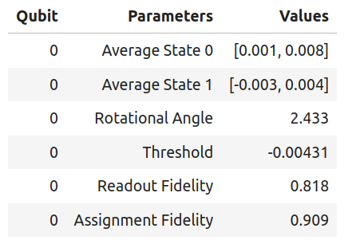

How to use Qibocal as a library
===============================

Qibocal also allows executing protocols without the standard :ref:`interface <interface>`.

In the following tutorial we show how to run a single protocol using Qibocal as a library.
For this particular example we will focus on the `single shot classification protocol
<https://github.com/qiboteam/qibocal/blob/main/src/qibocal/protocols/characterization/classification.py>`_.

.. code-block:: python

    from qibocal.protocols.characterization import Operation
    from qibolab import create_platform

    # allocate platform
    platform = create_platform("....")
    # get qubits from platform
    qubits = platform.qubits

    # we select the protocol
    protocol = Operation.single_shot_classification.value

``protocol`` is a `Routine <https://qibo.science/qibocal/stable/api-reference/qibocal.auto.html#qibocal.auto.operation.Routine>`_ object which contains all the necessary
methods to execute the experiment.

In order to run a protocol the user needs to specify the parameters.
The user can check which parameters need to be provided either by checking the
documentation of the specific protocol or by simply inspecting ``protocol.parameters_type``.
For ``single_shot_classification`` we can pass just the number of shots
in the following way:

.. code-block:: python

    parameters = experiment.parameters_type.load(dict(nshots=1024))

After defining the parameters, the user can perform the acquisition using
``experiment.acquisition`` which accepts the following parameters:

* params (experiment.parameters_type): input parameters for the experiment
* platform (qibolab.platform.Platform): Qibolab platform class
* qubits (dict[QubitId, QubitPairId]) dictionary with qubits where the acquisition will run

and returns the following:
* data (experiment.data_type): data acquired
* acquisition_time (float): acquisition time on hardware

.. code-block:: python

    data, acquisition_time = experiment.acquisition(params=parameters,
                                                    platform=platform,
                                                    qubits=qubits)

The user can now use the raw data acquired by the quantum processor to perform
an arbitrary post-processing analysis. This is one of the main advantages of this API
compared to the cli execution.

The fitting corresponding to the experiment (``experiment.fit``) can be launched in the
following way:

.. code-block:: python

    fit, fit_time = experiment.fit(data)

To be more specific the user should pass as input ``data`` which is of type
``experiment.data_type`` and the outputs are the following:

* fit: (experiment.results_type) input parameters for the experiment
* fit_time (float): post-processing time

It is also possible to access the plots and the tables generated in the
report using ``experiment.report`` which accepts the following parameters:

* data: (``experiment.data_type``) data structure used by ``experiment``
* qubit (Union[QubitId, QubitPairId]): post-processing time
* fit: (``experiment.results_type``): data structure for post-processing used by ``experiment``

.. code-block:: python

    # Plot for qubit 0
    qubit = 0
    figs, html_content = experiment.report(data=data, qubit=0, fit=fit)

``experiment.report`` returns the following:

* figs: list of plotly figures
* html_content: raw html with additional information usually in the form of a table

In our case we get the following figure for qubit 0:

.. code-block:: python

    figs[0]

.. image:: classification_plot.png

and we can render the html content in the following way:

.. code-block:: python

    import IPython
    IPython.display.HTML(html_content)

