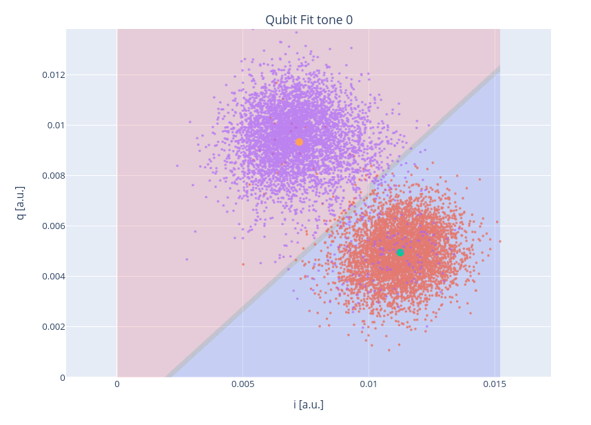

Basic examples
==============

In this section we are going to explain briefly how to perform
the calibration of single qubit devices.

Dummy guide for single qubit calibration
----------------------------------------

Not flux tunable qubits
~~~~~~~~~~~~~~~~~~~~~~~

The calibration of a not flux-tunable superconducting chip
includes the following steps:

#. Resonator characterization:
    #. Probing the resonator at high power
    #. Estimating the readout amplitude through a punchout
    #. Finding the dressed resonator frequency
#. Qubit characterization
    #. Finding the qubit frequency
    #. Calibrating the :math:`\pi` pulse
#. Building classification model for :math:`\ket{0}` and  :math:`\ket{1}`

We are going to explain how to use qibocal to address each step of the calibration.

Resonator characterization
^^^^^^^^^^^^^^^^^^^^^^^^^^

Each qubit is coupled to a resonator to perform the measurement.
The resonator is characterized by a bare frequency that can be extracted
by running a resonator spectroscopy at high power. To perform this experiment
with qibocal it is sufficient to write the following runcard `spectroscopy.yaml`:

.. code-block:: yaml

    platform: <platform_name>

    qubits: [0]

    actions:

      - id: resonator_spectroscopy high power
        priority: 0
        operation: resonator_spectroscopy
        parameters:
            freq_width: 60_000_000
            freq_step: 200_000
            amplitude: 0.6
            power_level: high
            nshots: 1024
            relaxation_time: 100000

the choice of the parameters is arbitrary. In this specific case the
user should make sure to specify an amplitude value sufficiently large.

This experiment can be launched with the following command:

.. code-block:: bash

    qq auto spectroscopy.yaml -o <output_folder>

It is then possible to visualize a report included in the output folder.

.. image:: ../protocols/resonator_spectroscopy_high.png

The expected signal is a lorentzian centered around the bare frequency of the resonator.

At lower power, the resonator will be coupled to the qubit in the dispersive regime.
The coupling manifests itself in a shift of the energy levels. In order to check at which
power we observe this shift it is possible to run a resonator punchout using the following
`punchout.yaml` runcard.

.. code-block:: yaml

    platform: <platform_name>

    qubits: [0]

    actions:

      - id: resonator punchout
        priority: 0
        operation: resonator_punchout
        parameters:
            freq_width: 40_000_000
            freq_step: 500_000
            amplitude: 0.03
            min_amp_factor: 0.1
            max_amp_factor: 2.4
            step_amp_factor: 0.3
            nshots: 2048
            relaxation_time: 5000

Which corresponds to a 2D scan in amplitude and readout frequency.
After executing the experiment with the previous syntax we should
see something like this.

.. image:: ../protocols/resonator_punchout.png

The image above shows that below 0.15 amplitude the frequency of the resonator
shifted as expected.

Finally, now that we have a reasonable guess for the readout amplitude we can
eventually run again a resonator spectroscopy putting the correct readout amplitude value.

Here is an example of a runcard.

.. code-block:: yaml

    platform: <platform_name>

    qubits: [0]

    actions:

      - id: resonator_spectroscopy low power
        priority: 0
        operation: resonator_spectroscopy
        parameters:
            freq_width: 60_000_000
            freq_step: 200_000
            amplitude: 0.03
            power_level: low
            nshots: 1024
            relaxation_time: 100000

Note that in this case we changed the ``power_level`` entry from
``high`` to ``low``, this keyword is used by qibocal to upgrade
correctly the QPU parameters depending on the power regime.

.. image:: ../protocols/resonator_spectroscopy_low.png

.. note::
    Depending on the resonator type the resonator frequency
    might appear as a deep or a peak.

Qubit characterization
^^^^^^^^^^^^^^^^^^^^^^

After having a rough estimate on the readout frequency and the readout amplitude, we
can start to characterize the qubit.

The qubit transition frequency :math:`\omega_{01}`,the frequency of the transition between state
:math:`\ket{0}` and  state :math:`\ket{1}`, is determined using a dispersive spectroscopy measurement.

Here is an example runcard:

.. code-block:: yaml

    platform: <platform_name>

    qubits: [0]

    actions:

      - id: qubit spectroscopy 01
        priority: 0
        operation: qubit_spectroscopy
        parameters:
            drive_amplitude: 0.5
            drive_duration: 4000
            freq_width: 100_000_000
            freq_step: 100_000
            nshots: 1024
            relaxation_time: 5000

For this particular experiment it is recommended to use
a ``drive_duration`` large compared to the coherence time of
the qubit.

Similarly to the resonator, we expect a lorentzian peak around :math:`\omega_{01}`
which will be our drive frequency.

.. note::
    By using high values of ``drive_amplitude`` it might be possible to see
    another peak which corresponds to :math:`\omega_{02}/2`.

.. note::
    Depending on the resonator type the qubit frequency
    might appear as a deep or a peak.

.. note::
    If the qubit is flux-tunable make sure to have a look at this :ref:`section <flux>`.

The missing step required to perform a transition between state :math:`\ket{0}` and state
:math:`\ket{1}` is to calibrate the amplitude of the drive pulse, also known as :math:`\pi` pulse.

Such amplitude is estimated through a Rabi experiment, which can be executed in qibocal through
the following runcard:

.. code-block:: yaml

    platform: <platform_name>

    qubits: [0]

    actions:

        - id: rabi
        priority: 0
        operation: rabi_amplitude_signal
        parameters:
            min_amp_factor: 0
            max_amp_factor: 1.1
            step_amp_factor: 0.1
            pulse_length: 40
            relaxation_time: 100_000
            nshots: 1024

In this particular case we are fixing the duration of the pulse to be 40 ns and we perform
a sweep in the drive amplitude to find the correct value. The :math:`\pi` corresponds to
first half period of the oscillation.

.. image:: ../protocols/rabi_amplitude.png

Classification model
^^^^^^^^^^^^^^^^^^^^

Now that we are able to produce :math:`\ket{0}` and :math:`\ket{1}` we need to build a model
that will discriminate between these two states, also known as `classifier`.
Qibocal provides several classifiers of different complexities including Machine Learning based
ones.

The simplest model can be trained by running the following experiment:

.. code-block:: yaml

    platform: <platform_name>

    qubits: [0]

    actions:

      - id: single shot classification 1
        priority: 0
        operation: single_shot_classification
        parameters:
            nshots: 5000

The expected results are two separated clouds in the IQ plane.

.. _flux:

Flux tunable qubits
~~~~~~~~~~~~~~~~~~~

When dealing with flux tunable qubits it is important to also
study how the qubit reacts when changing the magnetic flux.
From the theory we know that by modifying the flux the qubit
frequency will be modified.

Usually we should characterize the qubit in the flux range where it is most insensitive to a
a change in flux, also know as ``sweetspot``.

We can study the flux dependence of the qubit using the following runcard:

.. code-block:: yaml

    platform: <platform_name>

    qubits: [0]

    actions:

      - id: qubit flux dependence
        priority: 0
        operation: qubit_flux
        parameters:
            freq_width: 100_000_000
            freq_step: 500_000
            bias_width: 0.20
            bias_step:  0.01
            drive_amplitude: 0.1
            nshots: 1024
            relaxation_time: 20_000

.. note::
    For more complicating applications the optimal point might not be
    the sweetspot.

Assessing the goodness of the calibration
~~~~~~~~~~~~~~~~~~~~~~~~~~~~~~~~~~~~~~~~~

Several experiments can be performed to estimate the goodness of the
calibration.

Measurement of the qubit coherences
^^^^^^^^^^^^^^^^^^^^^^^^^^^^^^^^^^^

The fidelity achievable using a superconducting qubit is limited
by the coherence times of the qubit.

To measure the energy decay of a qubit state, also known as :math:`\\T_1`.
The experiment consists in bringing the qubit to :math:`\ket{1}` and then
performing a measurement after a waiting time :math:`\tau`.

Here is the runcard:

.. code-block:: yaml

    platform: <platform_name>

    qubits: [0]

    actions:

      - id: t1
        priority: 0
        operation: t1
        parameters:
            delay_before_readout_end: 200000
            delay_before_readout_start: 50
            delay_before_readout_step: 1000
            nshots: 1024
            relaxation_time: 300000

We expect to see an exponential decay whose rate will give us
the factor :math:`\\T_1`.

We can also estimate the loss of quantum information due to the
loss in the knowledge of the phase of a quantum state. Such parameter is
denoted with :math:`\\T_2` and can be estimated through a Ramsey experiment.

.. TODO: change in RAMSEY probability

.. code-block:: yaml

    platform: <platform_name>

    qubits: [0]

    actions:

      - id: ramsey detuned
        priority: 0
        operation: ramsey
        parameters:
            delay_between_pulses_end: 40000
            delay_between_pulses_start: 100
            delay_between_pulses_step: 1000
            n_osc: 0
            nshots: 4096
            relaxation_time: 200000

Fidelities
^^^^^^^^^^

We can estimate the `assignment fidelity` :math:`\\\mathcal{F}` which is defined as
:cite:p:`gao2021practical`

.. math::

  \mathcal{F} = 1 - \frac{P(m=0|\ket{1}_i) + P(m=1|\ket{0}_i)}{2}

where :math:`P(m=X|\ket{Y}_i)` is the probability of measuring :math:`\ket{X}`
after having prepared  :math:`\ket{Y}`.

.. code-block:: yaml

    platform: <platform_name>

    qubits: [0]

    actions:

      - id: readout characterization
        priority: 0
        operation: readout_characterization
        parameters:
            nshots: 5000

In order to estimate a gate-fidelity which is unaffected by
State Preparation And Measurement (SPAM) errors it is possible to run a standard
randomized benchmarking.

.. code-block:: yaml

    platform: <platform_name>

    qubits: [0]

    actions:

      - id: standard rb bootstrap
        priority: 0
        operation: standard_rb
        parameters:
            depths: [10, 50, 100, 150, 200, 250, 300, 350, 400, 450, 500]
            n_bootstrap: 10
            niter: 256
            nshots: 128

.. rubric:: References

.. bibliography::
   :filter: docname in docnames
   :style: plain
