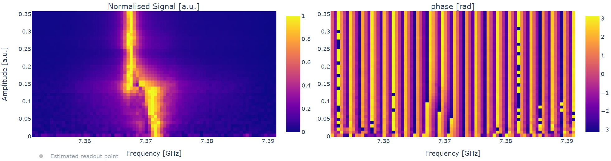

Single qubit gates calibration for dummies
==========================================

In this section we are going to explain briefly how to perform
the calibration of single qubit devices.

Not flux tunable qubits
-----------------------

The calibration of a not flux-tunable superconducting chip
includes the following steps:

#. Resonator characterization:
    #. Probing the resonator at high power
    #. Estimate the readout amplitude through a punchout
    #. Finding the dressed resonator frequency
#. Qubit characterization
    #. Finding the qubit frequency
    #. Calibration of :math:`\pi` pulse
#. Build classification model for :math:`\ket{0}` and  :math:`\ket{1}`

We are going to explain how to use qibocal to address each step of the calibration.

Resonator characterization
^^^^^^^^^^^^^^^^^^^^^^^^^^

Usually each qubit is coupled to a resonator to perform the readout.
The resonator is characterized by a bare frequency that we can extract
by running a resonator spectroscopy at high power. To peform this experiment
with qibocal it is sufficient to write the following runcard `spectroscopy.yaml`:

.. code-block:: yaml

    platform: <platform_name>

    qubits: [0]

    actions:

      - id: resonator_spectroscopy high power
        priority: 0
        operation: resonator_spectroscopy
        parameters:
            freq_width: 60_000_000
            freq_step: 200_000
            amplitude: 0.6
            power_level: high
            nshots: 1024
            relaxation_time: 100000

which can then be executed with the following command:

.. code-block:: bash

    qq auto spectroscopy.yaml -o <output_folder>

It is then possible to visualize a report included in the output folder.

.. image:: ../protocols/resonator_spectroscopy_high.png

The expected signal is a lorentzian centered around the bare frequency of the resonator.

At lower power, the resonator will coupled to the qubit in the dispersive regime.
The coupling manifests itself in a shift of the energy levels. In order to check at which
power we observe this shift it is possible to run a resonator punchout using the following
`punchout.yaml` runcard.

.. code-block:: yaml

    platform: <platform_name>

    qubits: [0]

    actions:

      - id: resonator punchout
        priority: 0
        operation: resonator_punchout
        parameters:
          freq_width: 40_000_000
          freq_step: 500_000
          amplitude: 0.03
          min_amp_factor: 0.1
          max_amp_factor: 2.4
          step_amp_factor: 0.3
          nshots: 2048
          relaxation_time: 5000

We can execute the runcard using the following command

.. code-block:: bash

    qq auto punchout.yaml -o <output_folder>

Here is the expected output:

The image above shows that below 0.15 amplitude the frequency of the resonator
shifted as expected.

Finally, now that we have a reasonable guess for the readout amplitude we can
run again a resonator spectroscopy putting the correct readout amplitude value.

Here is an example of a runcard.

.. code-block:: yaml

    platform: <platform_name>

    qubits: [0]

    actions:

      - id: resonator_spectroscopy low power
        priority: 0
        operation: resonator_spectroscopy
        parameters:
            freq_width: 60_000_000
            freq_step: 200_000
            amplitude: 0.03
            power_level: low
            nshots: 1024
            relaxation_time: 100000

and here is the output.

.. image:: ../protocols/resonator_spectroscopy_low.png

Qubit characterization    min_amp_factor: -1.1
            max_amp_factor: 1.1
            step_amp_factor: 0.1
            pulse_length: 40
            relaxation_time: 100_000
            nshots: 1024
^^^^^^^^^^^^^^^^^^^^^^

After having a rough estimate on the readout frequency and the readout amplitude, we
can start to characterize the qubit.

To estimate the qubit frequency :math:`\omega_{01}`, the frequency of the transition between state
:math:`\ket{0}` and  state :math:`\ket{1}`, we can run a qubit spectroscopy experiment, which will
probe the qubit at different drive frequencies.

Here is an example runcard:

.. code-block:: yaml

    platform: <platform_name>

    qubits: [0]

    actions:

      - id: qubit spectroscopy 01
        priority: 0
        operation: qubit_spectroscopy
        parameters:
            drive_amplitude: 0.5
            drive_duration: 4000
            freq_width: 100_000_000
            freq_step: 100_000
            nshots: 1024
            relaxation_time: 5000

PUT PLOT HERE

Similarly to the resonator, we expect a lorentzian peak around :math:`\omega_{01}`
which will be our drive frequency.

The missing step required to perform a transition between state :math:`\ket{0}` and state
:math:`\ket{1}` is to calibrate the amplitude of the drive pulse, also known as :math:`\pi` pulse.

Such amplitude is estimated through a Rabi experiment, which can be executed in qibocal through
the following runcard:

.. code-block:: yaml

    platform: <platform_name>

    qubits: [0]

    actions:

        - id: rabi
        priority: 0
        operation: rabi_amplitude_signal
        parameters:
            min_amp_factor: 0
            max_amp_factor: 1.1
            step_amp_factor: 0.1
            pulse_length: 40
            relaxation_time: 100_000
            nshots: 1024

in this particular case we are fixing the duration of the pulse to be 40 ns and we peform
a sweep in the drive amplitude to find the correct value. Experimentally we expect a sinusoidal
behavior.

PUT PLOT HERE

Classification model
^^^^^^^^^^^^^^^^^^^^

Now that we are able to produce :math:`\ket{0}` and :math:`\ket{1}` we need to build a model
that will discriminate between these two states, also known as `classifier`.
Qibocal provides several classifiers of different complexities including Machine Learning based
ones.

The simplest model can be trained by running the following experiment:

.. code-block:: yaml

    platform: <platform_name>

    qubits: [0]

    actions:

        - id: single shot classification 1
          priority: 0
          main: allXY
          operation: single_shot_classification
          parameters:
          nshots: 5000

The expected results are two separated clouds in the IQ plane.

ADD MISSING PLOT

Flux tunable qubits
-------------------

For flux-tunable qubits it is also required to calibrate the sweetspot

#. Resonator characterization:
    #. Probing the resonator at high power
    #. Estimate the readout amplitude through a punchout
    #. Finding the dressed resonator frequency
#. Qubit characterization
    #. Finding the qubit frequency
    #. Calibrating the qubit sweetspot
    #. Calibration of :math:`\pi` pulse
#. Build classification model for :math:`\ket{0}` and  :math:`\ket{1}`

Assessing the goodness of the calibration
----------------------------------------

Evaluating coherence and dephasing
^^^^^^^^^^^^^^^^^^^^^^^^^^^^^^^^^^

Fidelities
^^^^^^^^^^

Fine tuning of calibration parameters
-------------------------------------
