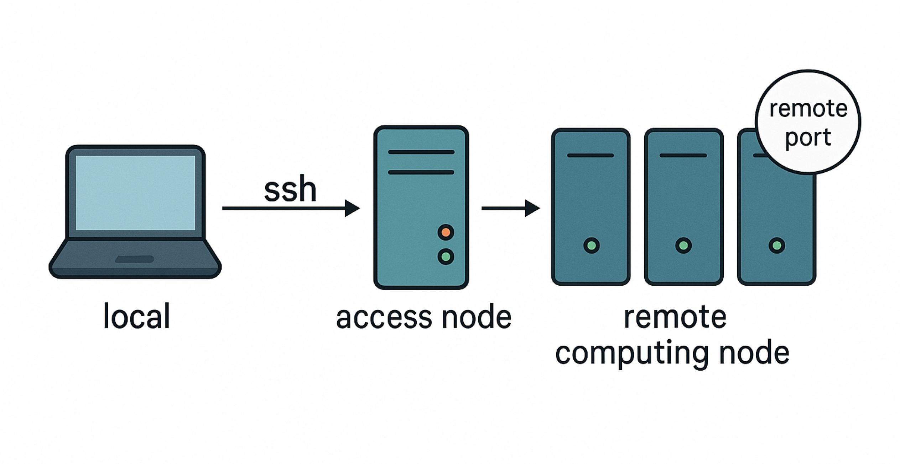

Interactive usage
=================

A great use of Qibocal is to run routines interactively, processing the results of the
routines in an interpreter or a notebook, or launching further ones only after receiving
results in the same environment.

An example of this workflow is shown in the `README
<https://github.com/qiboteam/qibocal#minimal-working-example>`_.

How to run it on a queue
------------------------

While Qibocal itself does not require any special handling for interactive usage, it is
common enough to place shared resource behind a queue infrastructure.

In these cases, you may experience some additional complications, since Qibocal has to
run on a machine with the capability of connecting to the control electronics.

To cater for this use case, the only additional requirement is to run your notebook (or
intepreter) on the machine with instrument access, and possibly establish a suitable
port forward for its interface just through ``ssh`` itself.

Since it is potentially complex to identify which remote address and port to forward,
the following script should help automating the process.

.. literalinclude:: ./connect-to-queue.bash
   :language: bash

Once the required server is dispatched as queue job with the script, the instructions to
connect will appear in the output (usually redirected by the queue system on a file).

.. note::

   If the system you are targeting, the *remote computing node*, is actually part of
   multiple networks, and you need to discriminate the correct one to use, just add the
   subnetwork as a string in the former

   E.g. you could use::

       SUBNET="192.168.XXX"

   to specify a local network whose 3rd byte is ``XXX`` (e.g. ``0``, ``1``, ..., ``255``)

Step-by-step guide
~~~~~~~~~~~~~~~~~~

In case of doubts, let's go step by step through the script usage.

#. the **script** itself is supposed to be executed on the **remote computing node**
   (cf. figure above), which is the one with direct access to the resources (thus, the
   one which is usually already behind the queue)
#. notice that the instructions printed in the output will direct you to establish a
   **further SSH connection**, which will be the bridge between the local system and the
   remote computing node, through the access node (cf. figure above), on it can be
   established with a further `ssh` command execution on the **local system**
#. eventually, the **client connection** should be established from the same **local
   system**

.. admonition:: Example: SLURM + laptop

   In the case of SLURM queue system, which is accessible through an access node, where
   the user `ssh` from its laptop:

   - the script is the one you should `sbatch` - possibly adding to it all the rest of
     the logic, as needed
   - the further `ssh` command (printed in the instructions) should be run on the laptop
   - the final URL to connect can be pasted in a browser on the same laptop (e.g.
     Mozilla Firefox)
